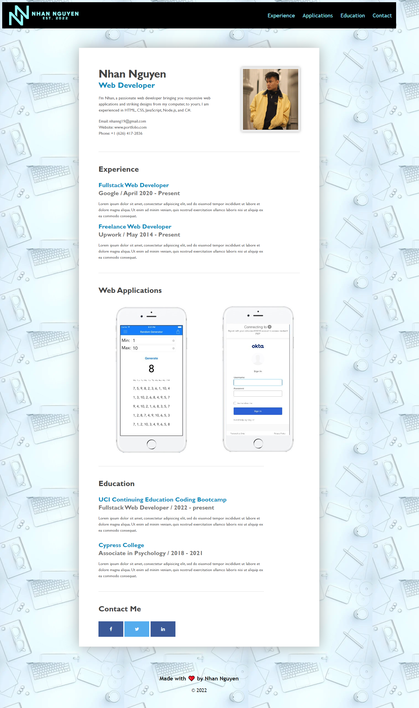

# 02_Advanced_CSS_Portfolio_NN
BootCamp Homework - 02 Advanced CSS: Portfolio

## The Challenge
Coding professionals across the industry, including data scientists, web developers, and software engineers, need coding portfolios. 
A coding portfolio is as essential to the job search process as a professional resume. 
Many employers expect coding portfolios from candidates and may actively search for them during the hiring process.
Portfolios demonstrate how candidates think and how well they can code. 
Coding portfolios also provide insight into a coder's creativity and attention to detail.
We're going to design a portfolio using our current knowledge of HTML and CSS to  deploy a web application like the one below. 



## User Story

```
AS AN employer
I WANT to view a potential employee's deployed portfolio of work samples
SO THAT I can review samples of their work and assess whether they're a good candidate for an open position
```

## Acceptance Criteria

```
GIVEN I need to sample a potential employee's previous work
WHEN I load their portfolio
THEN I am presented with the developer's name, a recent photo or avatar, and links to sections about them, their work, and how to contact them
WHEN I click one of the links in the navigation
THEN the UI scrolls to the corresponding section
WHEN I click on the link to the section about their work
THEN the UI scrolls to a section with titled images of the developer's applications
WHEN I am presented with the developer's first application
THEN that application's image should be larger in size than the others
WHEN I click on the images of the applications
THEN I am taken to that deployed application
WHEN I resize the page or view the site on various screens and devices
THEN I am presented with a responsive layout that adapts to my viewport
``` 

## The Process
To satisfy the criteria, we had to:
- Identify a proper semantic structure for the HTML and CSS file
- Provide descriptive comments for each section of the HTML and CSS file
- Apply functional links to the portfolio
- Provide relevation informations of the candidate
- Modify the CSS file so that the web applciation can fit any screen size

Specific sections of the HTML file

```
Functional navigation bar that users can interface with to scroll 
About me section describing the candidate along with a headshot
Experience section demonstrating candidate's work history
Lines to seperate sections
Web application sections showcasing candidate's previous projects
Contact section where users can find candidate's social media accounts
Footer to close off the page
```

Specific modifications to the CSS file

```
Navigation bar's position is fixed while scrolling through the page
Wrap ID to fit all content in a smaller frame, added background image
Changed position, font style, font color, and font size of specific id and classes
Added animation for the web application section when users hover over an image
Added Social Media buttons
```

## The Result
After dynamically coding the HTML and CSS file together, we were able to provide an engaging, efficient, and stuctured web application that showcases our portfolio.

## Submission
This project was uploaded to GitHub at the following respository link:
[https://github.com/nhanng19/challenge02](https://github.com/nhanng19/challenge02)

Depolyed Web Application Link:
[https://nhanng19.github.io/challenge02/develop/index](https://nhanng19.github.io/challenge02/develop/index)
